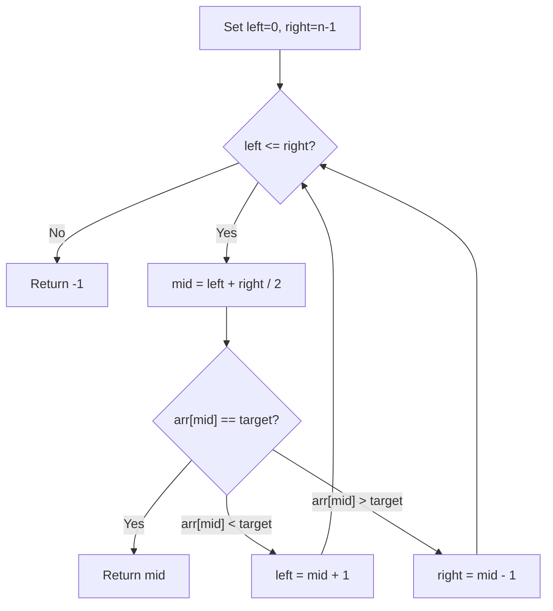

# Binary Search

Binary search finds a target in a **sorted array** by halving the search space each step.

## Time Complexity

$$O(\log n)$$

Much faster than linear search $O(n)$ for large arrays.

## Algorithm



## Implementation

```python showLineNumbers
def binary_search(arr: list, target: int) -> int:
    left, right = 0, len(arr) - 1

    while left <= right:
        mid = (left + right) // 2
        if arr[mid] == target:
            return mid
        elif arr[mid] < target:
            left = mid + 1
        else:
            right = mid - 1

    return -1
```

## Example

Search for `7` in `[1, 3, 5, 7, 9, 11]`:

| Step | left | right | mid | arr[mid] |
|------|------|-------|-----|----------|
| 1    | 0    | 5     | 2   | 5        |
| 2    | 3    | 5     | 4   | 9        |
| 3    | 3    | 3     | 3   | 7 ✓      |

## Related Notes

- [[sorting-algorithms]]
- [[time-complexity]]
- [[recursion]]
