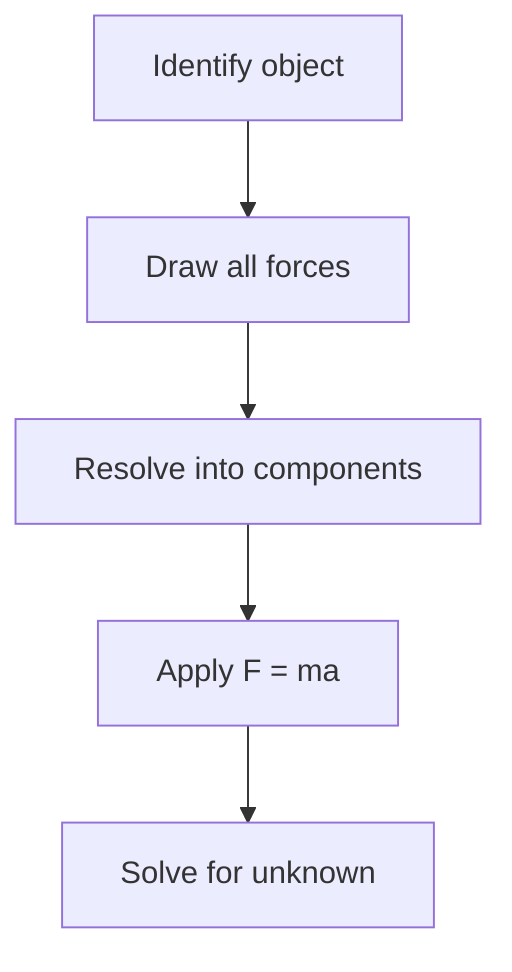

# Newton's Laws of Motion

## First Law (Inertia)

An object remains at rest or in uniform motion unless acted on by a net external force.

$$\sum F = 0 \implies \frac{dv}{dt} = 0$$

## Second Law

$$F = ma$$

Or in full vector form:

$$\vec{F} = m\vec{a} = m\frac{d^2\vec{r}}{dt^2}$$

## Third Law

For every action there is an equal and opposite reaction:

$$\vec{F}_{AB} = -\vec{F}_{BA}$$

## Work and Energy

Work done by a force:

$$W = \int \vec{F} \cdot d\vec{s} = Fd\cos\theta$$

Kinetic energy:

$$E_k = \frac{1}{2}mv^2$$

Work-energy theorem:

$$W_{net} = \Delta E_k$$

## Free Body Diagram Flow

## Related Notes

- [[momentum]]
- [[energy-conservation]]
- [[circular-motion]]
